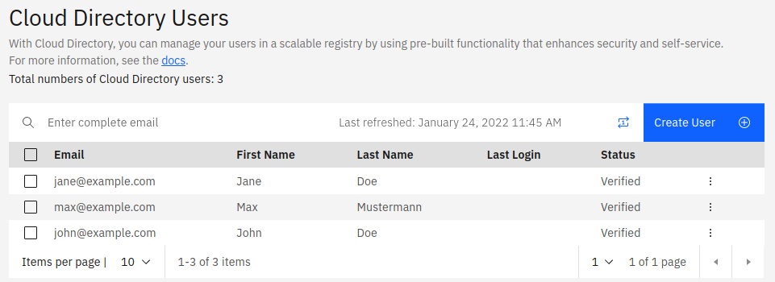

# Onboarding teams for short-lived projects to IBM Cloud

Short-lived projects like hackathons or workshops often have the following characteristics:
- similar privileges for everyone on the project,
- only few IAM (Identity and Access Management) roles, 
- preferred simple administration (setup, running it, cleanup) over tightest security.

Additionally, such projects often are repeated with similar setup, but other participants. So, how do you onboard them efficiently?

### Terraform scripts for App ID and IAM
This repository holds sample [Terraform code](terraform) to
- provision an IBM App ID instance with adequate configuration of security settings and basic customization of the included Cloud Directory,
- create an IAM access group with a sample policy for resource access and a dynamic rule to include App ID users,
- create an IAM trusted profile with similar properties as the access group.

The Terraform code does not use any common backend storage, so that the three parts can be used independently.

### Python script to create users in App ID
To create a batch of users in the App ID instance, we can utilize the App ID management APIs. The provided [Python script](user_upload/addUsers.py) reads a CSV file with user data and adds them to the App ID Cloud Directory. Users can then reset their password and change it to their own before logging into IBM Cloud.

# Files

| Directory                      | Content |
|--------------------------------|----------|
| `terraform`                    | Common configuration variables|
| `terraform/01-appid`           | Deploy an App ID instance to a new resource group |
| `terraform/02-accessgroup`     | Create an Access Group with a sample policy and a dynamic rule. The dynamic rule refers to an identity provider (IdP) based on the App ID instance. |
| `terraform/03-trustedprofile`  | Create a Trusted Profile with a sample policy.|
| `user_upload`                  | Python script to easily add a batch of users to App ID and its Cloud Direcory |

# Usage
### Terraform
To deploy the objects defined in the Terraform code, few steps are needed:

1. Copy over [config.tfvars.sample](terraform/config.tfvars.sample) to a file **config.tfvars**.
2. Edit the values for the variables in **config.tfvars**. This is mainly an IBM Cloud API key and the deployment region.
3. Switch into [01-appid](terraform/01-appid), then initialize the environment:
   ```
   terraform init
   ```

   Generate a plan to see the changes (can be skipped):
   ```
   terraform plan -var-file=../config.tfvars
   ```

   And apply the changes:
   ```
   terraform apply -var-file=../config.tfvars
   ```

   At the end of a successful "apply", the script prints the App ID tenant ID, the region and the IBM API key. The three are required to configure the Python script later on.

4. Go to the [IBM Cloud IAM settings for Identity Providers](https://cloud.ibm.com/iam/identity-providers) and create a new IdP (Identity Provider) based on the newly created App ID instance.
   

5. Once done, check the **Realm ID** and copy it to the file **config.tfvars**.
6. Switch into either [02-accessgroup](terraform/02-accessgroup) or [03-trustedprofile](terraform/03-trustedprofile) and run the same commands as shown under 3.

Note that you could change the **App ID instance** assigned to the **Identity Provider** (see step 4.), keeping the **Realm ID**. In other words, the Realm ID is a property of the IdP, not the App ID instance.

Once done with deploying App ID and access groups and / or a trusted profiles, add users to App ID's Cloud Directory. You can add them either in the service console (browser) or by API. Make sure to define **custom attributes** for each user, matching what is defined in the dynamic rules (access group) or claim rules (trusted profile). See the next section for how to use the provided Python script which is based on the API.


### Add users with Python script
A small Python script to add several users to App ID at once is provided in the directory [user_upload](user_upload). To use it,
1. Copy over [.env.sample](user_upload/.env.sample) to **.env** and set the variables appropriately. Or define the variables in your environment. You can use the values printed by the Terraform script when deploying App ID (see step 3 above).
2. Adapt **users.csv** to the list of your users you want to create. The given name, family name, email address, and custom attributes make up a single user record.
3. Invoke the script [addUsers.py](user_upload/addUsers.py), e.g.:
   ```
   python3 addUsers.py
   ```

   or to use **my_users.csv** as input file:
   ```
   USER_FILE=my_users.csv python3 addUsers.py
   ```
The script prints information about each added user. You can also verify in the App ID Cloud Directory that the users have been added:




### User login
To log in to IBM Cloud utilizing App ID as identity provider, the IdP URI based on the following scheme needs to be used:
`https://cloud.ibm.com/authorize/account-id/realm-id`

The App ID login form should appear. If required, users can reset their (randomly assigned initial) password.
