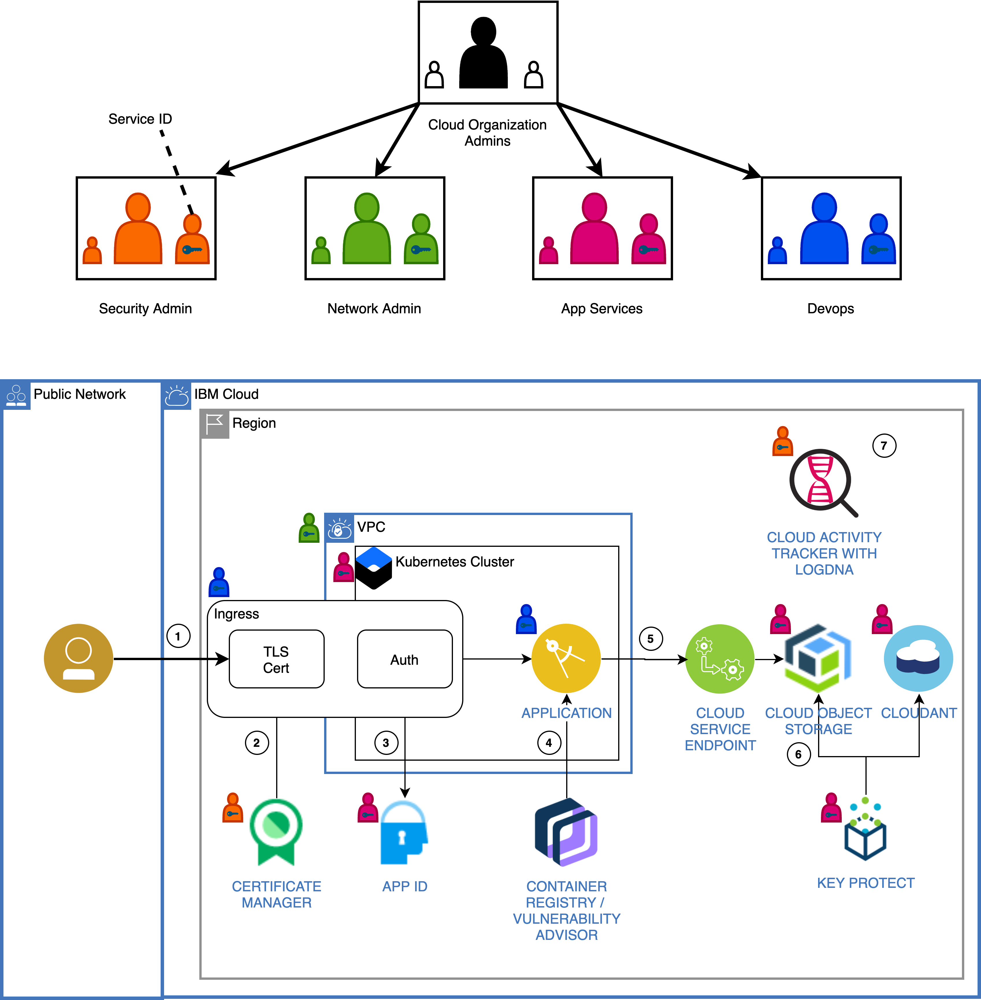

# Terraform files for onboarding a cloud development project

The files in this repository are samples for the following IBM Cloud blog post:
- [Blueprinting the Onboarding of Cloud Projects Using Terraform](https://www.ibm.com/cloud/blog/blueprinting-the-onboarding-of-cloud-projects-using-terraform).

They provide a rough skeleton to demonstrate topics discussed in that blog post. Thus, only some of the files are provided which are required to deploy the full project. The IBM Cloud solution tutorial ["Apply end to end security to a cloud application"](https://cloud.ibm.com/docs/solution-tutorials?topic=solution-tutorials-cloud-e2e-security) is used as sample project or proof-point for the onboarding process.

Read ["Getting started with Terraform"](https://cloud.ibm.com/docs/terraform?topic=terraform-getting-started) to learn how to set up your environment for using Terraform with IBM Cloud.

### Structure
Terraform files are organized in directories and applied folder by folder, in ascending order.

- [000-base](000-base): Corporate base layer for all projects
- [010-account-admin](010-account-admin): Project-specific setup by the account owner or super admin ("Cloud Organization Admins")
- [020-security-admin](020-security-admin):
- ...
- [040-app-services](040-app-services):
- ...
  

### Deployment flow
It is assumed that the account is organized similar to this:

- **Cloud Organization Administrator(s)**: account owner or super administrator who sets up users, service IDs, and access groups (AG) as well as account-level resources.
- **Security Administrators**: Access Group to perform security management and audits
- **Network Administrators**: Access Group for managing network resources, such as Virtual Private Clouds (VPC)
- **Application Services**: Access Group to set up application-related resources including the Kubernetes cluster.
- **Devops**: Access Group to manage app deployment as well as monitoring of the overall system status.

Typically, except for the initial account setup performed by the account owner or member of the Cloud Organization Administrators, all resources are deployed by service IDs. This ensures that resources are not owned by users (persons), but are independently managed. It is assumed that actions performed by service IDs are kicked off by a controlled process after required approvals.

Resource overview for the scenario from ["Apply end to end security to a cloud application"](https://cloud.ibm.com/docs/solution-tutorials?topic=solution-tutorials-cloud-e2e-security):

To deploy the managed resources required for this scenario, a flow similar to this following could be utilized:

- The account owner or member of Cloud Organization Administrators uses the account blueprint based on the account onboarding checklist to perform the initial account setup.
- Thereafter, with the general blueprint in place, the account is tailored to the application or development requirements. In the case of the mentioned security tutorial, the terraform files found in the Cloud Organization Administrator directory are applied. This adds users, additional access groups as well as service IDs. Moreover, a new API key is created for each service ID. The API keys are stored in separate files, named after the project name and service ID. This step is performed by the same person or group member as in the previous step.
- Next, the API key for the security administrator service ID is used to apply the Security Administrator files.
- Similarly, the network service ID and its API key are utilized to deploy the Network Administrator resources.
- Thereafter, the Application resources are deployed using the App service ID and its API key.
- Last, but not least, with the API key for the DevOps service ID the application itself is deployed by using the DevOps terraform files.

Instead of utilizing service IDs, a member of the related Access Group / administrative group (security / network / application / DevOps) could deploy the resources. The necessary privileges are assigned to the access group, not individual user accounts or service IDs.