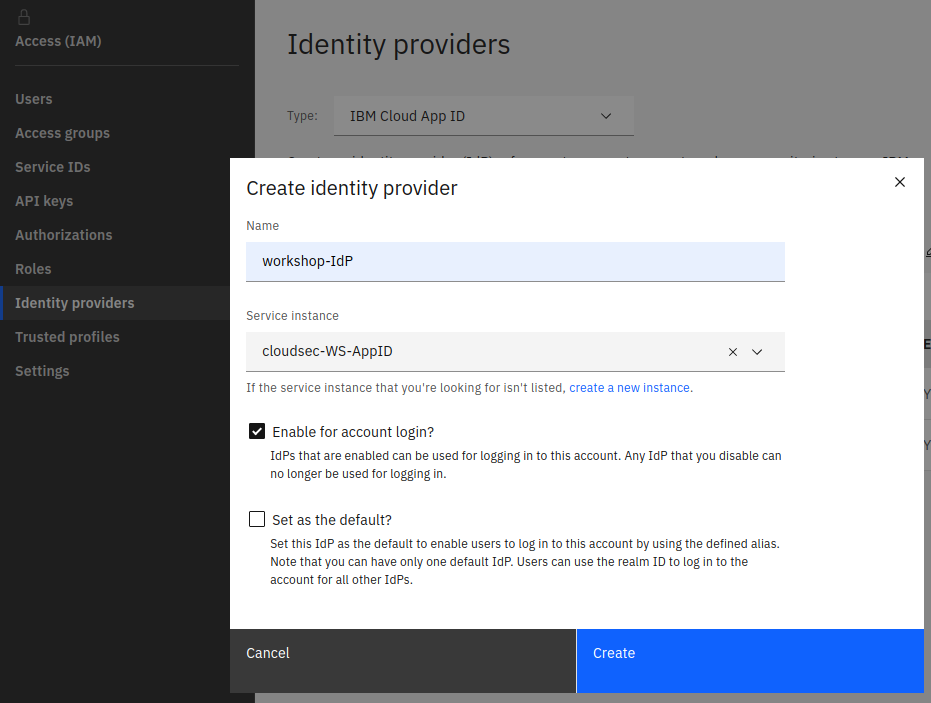
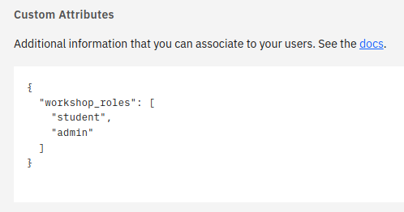
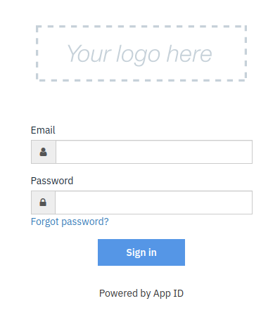

# Onboarding teams for short-lived projects to IBM Cloud

Short-lived projects like hackathons or workshops often have the following characteristics:
- similar privileges for everyone on the project,
- only few IAM (Identity and Access Management) roles, 
- preferred simple administration (setup, running it, cleanup) over tightest security.

Additionally, such projects often are repeated with similar setup, but other participants. So, how do you onboard them efficiently?

This repository holds sample Terraform code to
- provision an IBM App ID instance with adequate configuration of security settings and basic customization of the included Cloud Directory,
- create an IAM access group with a sample policy for resource access and a dynamic rule to include App ID users,
- create an IAM trusted profile with similar properties as the access group.

The Terraform code does not use any common backend storage, so that the three parts can be used independently.


# Files

| Directory                      | Content |
|--------------------------------|----------|
| `terraform`                    | Common configuration variables|
| `terraform/01-appid`           | Deploy an App ID instance to a new resource group |
| `terraform/02-accessgroup`     | Create an Access Group with a sample policy and a dynamic rule. The dynamic rule refers to an identity provider (IdP) based on the App ID instance. |
| `terraform/03-trustedprofile`  | Create a Trusted Profile with a sample policy.|

# Usage
To deploy the objects defined in the code, few steps are needed:

1. Copy over [config.tfvars.sample](terraform/config.tfvars.sample) to a file **config.tfvars**.
2. Edit the values for the variables in **config.tfvars**. This is mainly an IBM Cloud API key and the deployment region.
3. Switch into [01-appid](terraform/01-appid), then initialize the environment:
   ```
   terraform init
   ```

   Generate a plan to see the changes (can be skipped):
   ```
   terraform plan -var-file=../config.tfvars
   ```

   And apply the changes:
   ```
   terraform apply -var-file=../config.tfvars
   ```
4. Go to the [IBM Cloud IAM settings for Identity Providers](https://cloud.ibm.com/iam/identity-providers) and create a new IdP (Identity Provider) based on the newly created App ID instance.
   

5. Once done, check the **Realm ID** and copy it to the file **config.tfvars**.
6. Switch into either [02-accessgroup](terraform/02-accessgroup) or [03-trustedprofile](terraform/03-trustedprofile) and run the same commands as shown under 3.

Note that you could change the **App ID instance** assigned to the **Identity Provider** (see step 4.), keeping the **Realm ID**. In other words, the Realm ID is a property of the IdP, not the App ID instance.

Once done with deploying App ID and access groups and / or a trusted profiles, add users to App ID's Cloud Directory. You can add them either in the service console (browser) or by API. Make sure to define **custom attributes** for each user, matching what is defined in the dynamic rules (access group) or claim rules (trusted profile).



To log in to IBM Cloud utilizing App ID as identity provider, the IdP URI based on the following scheme needs to be used:
`https://cloud.ibm.com/authorize/account-id/realm-id`

The App ID login form should appear. If required, users can reset their (randomly assigned initial) password.
